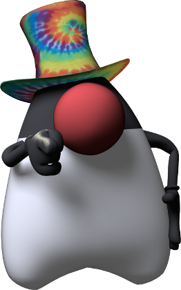

Llamada de presentaciones Java Day Guatemala 2014
=================================================

**¡Queremos tenerte como expositor en Java Day 2014!**

**Java Day Guatemala es la conferencia Java más grande de centroamerica**, durante tres ediciones hemos construido un punto de encuentro para desarrolladores, arquitectos y entusiastas de Java en Guatemala.

El Java Day se llevara a cabo el día **11 de Octubre de 2014** y -a diferencia de otras conferencias- Java Day Guatemala es realizada por y para la comunidad. 

¡Participa como presentador!
============================
El Grupo de Usuarios Java de Guatemala -[GuateJUG](http://www.guate-jug.net)- invita a todos aquellos interesados a compartir su conocimiento mediante **conferencias para publico principiante, intermedio y avanzado**.

¿Tienes algo interesante que deseas compartir con la comunidad?, ¿Innovaciones implementadas en Java?, ¿Casos de exito en Java?. **Nosotros y los asistentes del Java Day queremos saber de ti**.  

Como todos los años, hemos dividido las conferencias en ejes temáticos, siendo estos:  
  
Core Java
---------
Todos aquellos tópicos relacionados a Java como plataforma de desarrollo, temas relacionados con APIs, bibliotecas de funciones, algoritmos, y conceptos utiles para programadores en general.
 
Lenguajes JVM 
-------------
Considerando que la Java Virtual Machine es políglota, se crea un espacio especial para todas las presentaciones relacionadas con Scala, JRuby, Groovy, Clojure, Jython, etc. Además de todos aquellos frameworks basados en estos lenguajes.
 
Java EE/Java Web
----------------
El foco de este eje son presentaciones de Java como plataforma de desarrollo enterprise, incluyendo Java Web, Java EE, Spring y OSGi, SOA y relacionados.

Java Mobile
-----------
Temas relacionados con desarrollo en dispositivos moviles y embedidos, Java Embedded, Java Me, Java TV, Android y relacionados. 

Tendencias/Casos de Exito/Comunidad
-----------------------------------
Porque no todo en esta vida es código, este espacio esta reservado a presentaciones de casos de exito, startups, trabajos académicos, tendencias de mercado (NoSQL, BigData, Cloud), nuevas metodologías (continuous delivery, DevOps), etc.

Herramientas
------------
Como no existe carpintero sin martillo, esta sección incluye todas aquellas tecnologías que facilitan la vida de los desarrolladores Java incluyendo IDEs, editores de texto, controladores de versiones, sistemas operativos, herramientas de construcción, pruebas, QA y mucho más.

Recepción de propuestas
=======================
Las propuestas serán recibidas a través del siguiente enlace:

[http://www.guate-jug.net/jday14/openconf/](http://www.guate-jug.net/jday14/openconf/)

Es importante notar que:

* Java Day es un evento comunitario, por tanto no se aceptaran presentaciones cuyo único objetivo sea la promoción de productos (el evento cuenta con planes de [patrocinio](http://www.guate-jug.net)).
* El presentador se compromete a liberar su presentación bajo una licencia que permita la libre distribución del contenido (sugerimos [CC-BY-SA 3.0 GT](http://creativecommons.org/licenses/by-sa/3.0/gt/), y que la misma sera entregada al menos 24 horas antes de su presentación en Java Day.
* No existe un limite de presentaciones por persona.

Fechas importantes
==================
Inicio de recepcion de propuestas: xx/xx/xxxx 

Fin de recepcion de propuestas: xx/xx/xxxx 

Anuncio de propuestas aceptadas y horario preeliminar: xx/xx/xxxx 

Curadores
=========  
Para asegurar la calidad de las presentaciones del Java Day, este año la selección de las charlas estará a cargo de reconocidos profesionales dentro de la comunidad Java en el país

* [Ing. MSc. Víctor Leonel Orozco](http://gt.linkedin.com/in/victororozco/)
* [Inga. Maria Castillo](http://gt.linkedin.com/pub/maria-castillo/12/b05/278)
* Curador 3
* Curador 4
* Curador 5
* Curador 6

Contacto: [info (arroba) guate-jug (punto) net](info@guate-jug.net)

¡Muchas gracias por tu participación y contribución!
